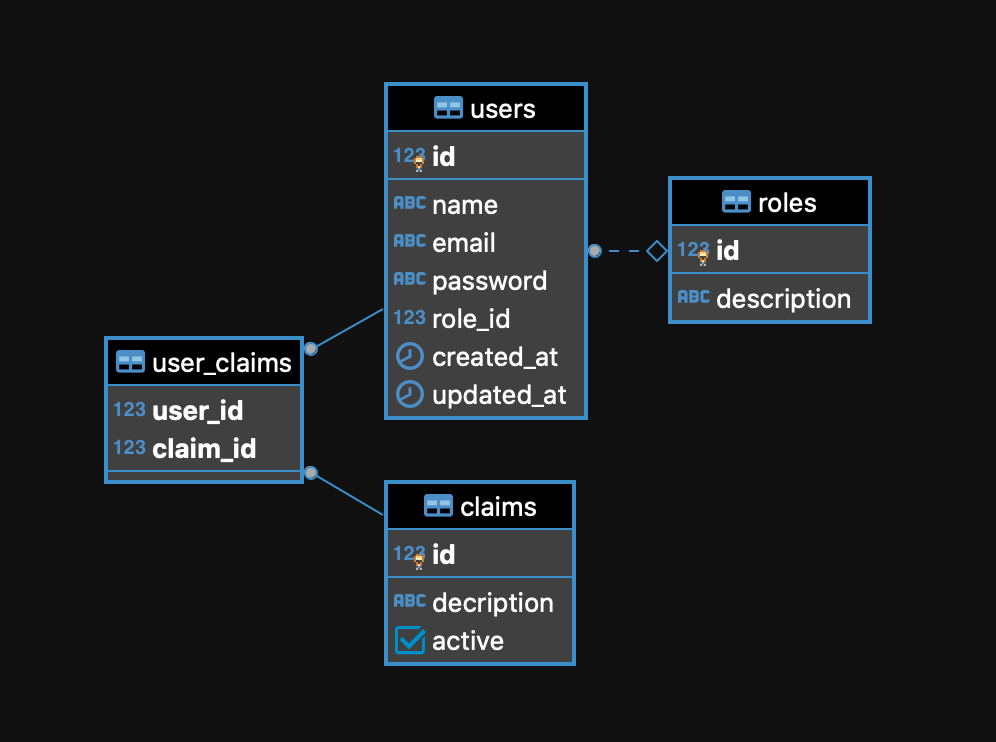

# User API

API REST para criação e gerenciamento de usuários, construída com **FastAPI**, **SQLAlchemy 2**, **Pydantic v2**, **Dynaconf** e gerenciamento de dependências via **UV**.

---

## Estrutura do banco de dados

```
roles        (id, description)
claims       (id, description, active)
users        (id, name, email, password, role_id, is_active, created_at, updated_at)
user_claims  (user_id, claim_id)  ← tabela associativa
```

Roles padrão inseridos pela migration inicial: `admin`, `manager`, `user`, `guest`.

## Diagrama ER para a estrutura do Banco de dados.


---

## Stack

| Camada            | Tecnologia                   |
|-------------------|------------------------------|
| Framework HTTP    | FastAPI 0.135+               |
| ORM               | SQLAlchemy 2 (sync)          |
| Validação         | Pydantic v2                  |
| Configuração      | Dynaconf (multi-ambiente)    |
| Hashing de senha  | bcrypt                       |
| Autenticação      | JWT (PyJWT / HS256)          |
| Injeção de Dep.   | dependency-injector          |
| Migrations        | Alembic                      |
| Package manager   | UV                           |
| Linter            | Ruff                         |

---

## Pré-requisitos

- Python 3.12+
- [UV](https://docs.astral.sh/uv/) instalado
- PostgreSQL rodando (ou Docker)

---

## Instalação

```bash
# Clonar e entrar no projeto
git clone <repo-url>
cd user_api

# Instalar dependências de produção + desenvolvimento
uv sync --extra dev
```

---

## Configuração

O ambiente é controlado pela variável `ENV_FOR_USERAPI` no arquivo `.env`:

```dotenv
# .env
ENV_FOR_USERAPI=development   # development | testing | production
```

O Dynaconf carrega o `.env` automaticamente — não é necessário exportar a variável manualmente.

Ajuste as credenciais do banco em `.secrets.toml` (nunca versionado):

```toml
# .secrets.toml
[development.database]
db_host     = "localhost"
db_port     = 5432
db_name     = "user_api_db"
db_user     = "postgres"
db_password = "postgres"
```

Para sobrescrever qualquer configuração via variável de ambiente, use o prefixo `USERAPI_`:

```bash
export USERAPI_DATABASE__DB_PASSWORD="outra-senha"
export USERAPI_SECURITY__SECRET_KEY="chave-secreta-producao"
```

> ⚠️ **Nunca** versione `.secrets.toml` ou `.env` com credenciais reais.

---

## Migrations

```bash
# Criar o banco de dados no PostgreSQL antes (se necessário)
createdb user_api_db

# Rodar todas as migrations
uv run alembic upgrade head

# Criar nova migration após alterar modelos
uv run alembic revision --autogenerate -m "descricao"
```

---

## Executar a API

```bash
uv run uvicorn app.main:app --reload
```

Acesse a documentação interativa em: http://localhost:8000/docs

---

## Endpoints

### Autenticação

#### `POST /api/v1/auth/token` — Login

```bash
curl -X POST http://localhost:8000/api/v1/auth/token \
  -H "Content-Type: application/json" \
  -d '{"email": "joao@example.com", "password": "MinhaSenh@123"}'
```

**Resposta:**
```json
{
  "access_token": "eyJhbGciOiJIUzI1NiIsInR5cCI6IkpXVCJ9...",
  "token_type": "bearer"
}
```

---

### Usuários

> Os endpoints `GET` e `PATCH` requerem o header `Authorization: Bearer <token>`.

#### `POST /api/v1/users/` — Criar usuário (público)

**Campos obrigatórios:** `name`, `email`, `role_id`
**Campo opcional:** `password` — se não informado, a API gera automaticamente.

```bash
curl -X POST http://localhost:8000/api/v1/users/ \
  -H "Content-Type: application/json" \
  -d '{
    "name": "Maria Silva",
    "email": "maria@example.com",
    "role_id": 1,
    "password": "MinhaSenh@123"
  }'
```

**Resposta `201`:**
```json
{
  "id": 1,
  "name": "Maria Silva",
  "email": "maria@example.com",
  "role_id": 1,
  "role": { "id": 1, "description": "admin" },
  "is_active": true,
  "created_at": "2024-01-01T00:00:00Z",
  "updated_at": "2024-01-01T00:00:00Z",
  "generated_password": null
}
```

> ⚠️ `generated_password` é retornado **apenas uma vez**, na criação sem senha informada. Salve-o imediatamente.

---

#### `GET /api/v1/users/` — Listar usuários

Suporta paginação via query params `skip` (padrão `0`) e `limit` (padrão `100`, máximo `500`).

```bash
curl "http://localhost:8000/api/v1/users/?skip=0&limit=10" \
  -H "Authorization: Bearer <token>"
```

---

#### `GET /api/v1/users/{id}` — Buscar por ID

```bash
curl http://localhost:8000/api/v1/users/1 \
  -H "Authorization: Bearer <token>"
```

---

#### `PATCH /api/v1/users/{id}` — Atualizar parcialmente

Campos atualizáveis: `name`, `role_id`, `is_active`.

```bash
# Desativar um usuário
curl -X PATCH http://localhost:8000/api/v1/users/1 \
  -H "Authorization: Bearer <token>" \
  -H "Content-Type: application/json" \
  -d '{"is_active": false}'
```

---

## Testes

Os testes usam SQLite em memória — não precisam de PostgreSQL.

```bash
# Todos os testes com cobertura
uv run pytest -v --cov=app --cov-report=term-missing

# Arquivo específico
uv run pytest tests/test_user_service.py -v

# Teste específico
uv run pytest tests/test_user_service.py::TestCreateUser::test_email_duplicado_levanta_email_already_exists -v
```

---

## Linter

```bash
uv run ruff check .
```

---

## Arquitetura

```
app/
├── api/
│   └── v1/
│       ├── endpoints/
│       │   ├── auth.py        ← POST /auth/token
│       │   └── users.py       ← CRUD de usuários
│       └── router.py          ← Agrega todos os routers
├── containers/
│   └── container.py           ← Container IoC (dependency-injector)
├── core/
│   ├── auth.py                ← JWT: criação, verificação, dependência Bearer
│   ├── config.py              ← Dynaconf settings loader
│   ├── exceptions.py          ← Exceções de domínio
│   └── security.py            ← Hash bcrypt + geração de senha
├── db/
│   ├── base.py                ← DeclarativeBase SQLAlchemy
│   └── session.py             ← Engine + get_db_session (dependência FastAPI)
├── models/                    ← Modelos SQLAlchemy
│   ├── claim.py
│   ├── role.py
│   └── user.py
├── repositories/              ← Padrão Repository
│   ├── base.py
│   ├── role_repository.py
│   └── user_repository.py
├── schemas/                   ← Pydantic schemas
│   ├── auth.py
│   ├── role.py
│   └── user.py
├── services/
│   └── user_service.py        ← Regras de negócio
└── main.py                    ← App factory + lifecycle + exception handlers
```
